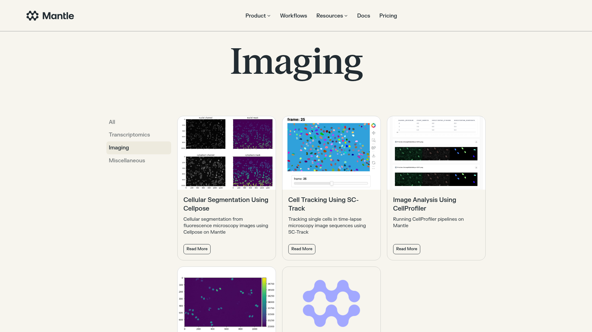
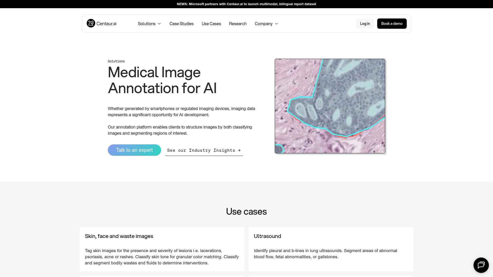
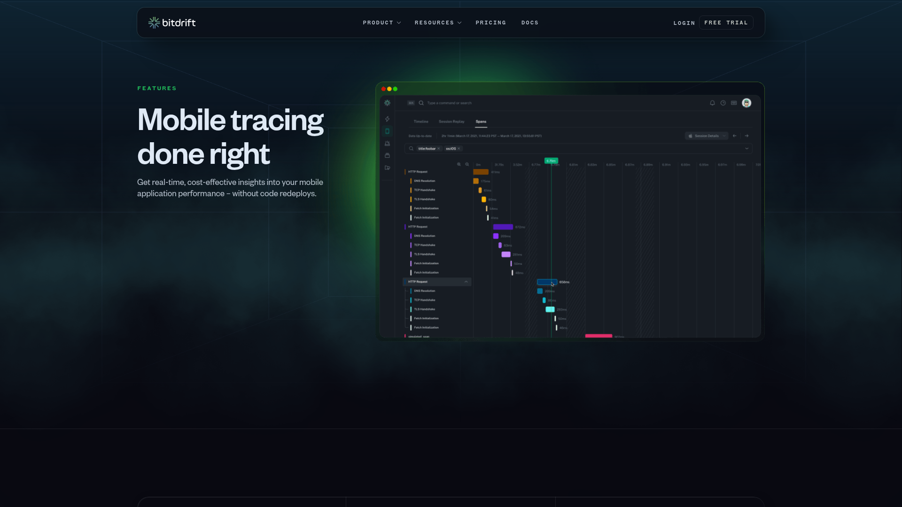
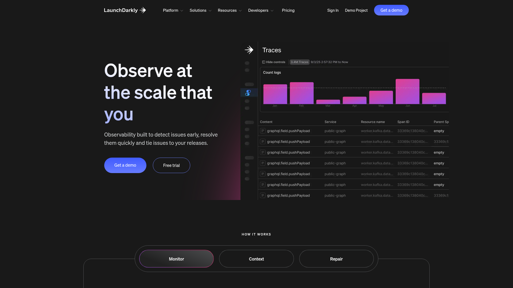
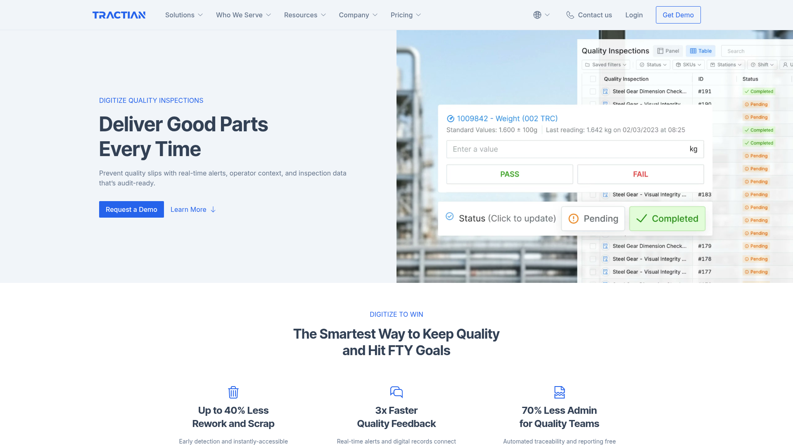

# Design Research: FIB/SEM Metrology Dashboard

## TL;DR

Lazyweb MCP returned the strongest usable references from microscopy image dashboards, medical annotation screens, industrial quality dashboards, and dark observability tools. The implementation should use a dense instrument-software layout: left image queue, central image canvas, right inspector, bottom result table, and explicit overlay/debug layers.

## Recommendations

1. Use a central viewer as the main object, not a decorative preview. Keep file navigation and settings out of the image surface.
2. Treat raw edge candidates like a debug/trace layer. Low-opacity ticks work better than large markers because dense SEM/FIB ROIs can produce many grayscale jumps.
3. Replace correctness-style confidence with coverage/count metrics. Candidate Coverage, Raw Edge Count, Pair Candidates, Selected Points, and Threshold match the actual algorithm.
4. Keep the palette restrained: charcoal surfaces, high-contrast text, cyan/green/yellow accents for ROI/raw/selected/fit layers.

## Applied Layout

```text
+--------------------------------------------------------------------------------+
| FIB/SEM Measurement Tool | current file | load | run | CSV                      |
+-------------------+--------------------------------------+---------------------+
| Image list        | Image viewer                         | Inspector           |
| thumbnails        | ROI + raw candidates + selected edge | settings            |
| mini result badges| legend + summary                     | overlay controls    |
|                   |                                      | candidate summary   |
+-------------------+--------------------------------------+---------------------+
| Result table: file, mode, ROI, value, raw edges, coverage, selected, threshold |
+--------------------------------------------------------------------------------+
```

## Key Lazyweb References


*MantleBio: microscopy image thumbnail grid with sidebar navigation and image actions.*


*Centaur: medical image annotation preview, useful for image-first hierarchy and annotation context.*


*bitdrift: dark trace/debug visualization with dense timeline and filters.*


*LaunchDarkly: dark observability dashboard with charts, sortable tables, and operational controls.*


*Tractian: manufacturing quality dashboard pattern with KPI status and actionable rows.*

## Patterns Used

- Large central visual workspace
- Left navigation/list for input images
- Right inspector for settings and selected result
- Bottom data table for batch result review
- Dark technical UI with restrained accent colors
- Layer toggles for debug overlays
- Count/coverage metrics rather than overconfident scoring

## Sources

- Lazyweb MCP `lazyweb_health`: healthy
- Lazyweb MCP `lazyweb_search`: scientific image analysis dashboard, medical image annotation tool, dark developer dashboard, defect inspection dashboard, metrology dashboard
- Reference page URLs from results: MantleBio, Centaur, bitdrift, LaunchDarkly, Tractian, Metofico, Langfuse
